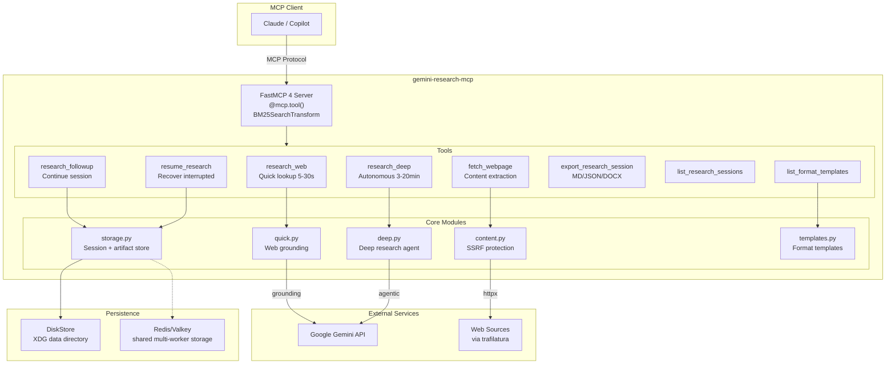

# Gemini Research MCP Server

[](https://pypi.org/project/gemini-research-mcp/)
[](https://github.com/machinemates-ai/gemini-research-mcp/actions/workflows/ci.yml)
[](https://www.python.org/downloads/)
[](https://opensource.org/licenses/MIT)

MCP server for AI-powered research using **Gemini**. Fast grounded search, URL extraction, comprehensive Deep Research, and session management.

Built on **FastMCP `4.0.0b5`** (beta, exact-pinned) with the modern sessionless
MCP protocol, **Gemini `3.8 Flash`**, MCP Tasks (SEP-1732), the guard-pattern
elicitation flow, a BM25-compacted tool catalog, and pluggable Disk/Redis
storage with a zero-configuration local default.

## Architecture


<details>
<summary>Mermaid source</summary>



</details>

## Tools

The server exposes a **BM25-compacted catalog**: only the 5 tools below plus
the synthetic `search_tools`/`call_tool` pair are listed by default
(`fastmcp.server.transforms.search.BM25SearchTransform`). Utility tools
(`fetch_webpage`, `research_followup`, `list_research_sessions`,
`list_format_templates`, `refine_research_plan`,
`inspect_mcp_server_for_gemini`) are hidden from the default
listing to keep the catalog small for LLM tool-selection, but remain fully
callable directly by name or via the `call_tool` proxy, and are discoverable
by relevance through `search_tools`.

| Tool | Description | Latency | Visible by default |
|------|-------------|---------|---------------------|
| `research_web` | Fast web search with citations | 5-30 sec | ✅ |
| `research_deep` | Multi-step autonomous research (MCP Tasks) | 3-20 min | ✅ |
| `research_deep_max` | Maximum-comprehensiveness Deep Research for exhaustive/high-stakes work | longer-running | ✅ |
| `resume_research` | Resume interrupted/in-progress sessions | instant | ✅ |
| `export_research_session` | Disk-first export to persistent Markdown, JSON, or DOCX artifacts | instant | ✅ |
| `search_tools` | Discover hidden utility tools by relevance (BM25) | instant | ✅ |
| `call_tool` | Proxy to invoke any hidden tool by name | varies | ✅ |
| `research_followup` | Continue conversation after research | 5-30 sec | discoverable |
| `list_research_sessions` | List saved research sessions | instant | discoverable |
| `list_format_templates` | Browse report format templates | instant | discoverable |
| `refine_research_plan` | Iterate on or approve a `collaborative_planning=True` plan | instant-3min | discoverable |
| `fetch_webpage` | Extract article content from a specific URL (SSRF-protected, chunkable) | 0.5-2 sec | discoverable |
| `inspect_mcp_server_for_gemini` | Inspect remote MCP reachability and schemas (diagnostic only) | varies | discoverable |

### `research_deep` / `research_deep_max` Deep Research parameters

| Parameter | Type | Default | Description |
|-----------|------|---------|--------------|
| `visualization` | `"off"` \| `"auto"` | `"off"` | Let the agent produce and persist supporting images/charts. Images are persisted as MCP resource artifacts (`research://exports/{id}`), never inlined as text. |
| `collaborative_planning` | boolean | `false` | Return the drafted research plan and an interaction ID instead of running the full report. Approve or iterate on the plan with `refine_research_plan(previous_interaction_id=..., decision="approve"|"iterate")`. |
| `mcp_servers` | array \| null | `null` | **Disabled.** Any non-empty value fails before network or Gemini API access because provider-side Deep Research remote MCP is not reliable. |

### `fetch_webpage` Parameters

`fetch_webpage` is discoverable through `search_tools` in the default server listing.

The `fetch_webpage` tool supports chunked reading for large pages and optional proxy routing:

| Parameter | Type | Default | Description |
|-----------|------|---------|-------------|
| `url` | string | required | HTTP/HTTPS URL to fetch |
| `max_length` | integer \| null | `null` | Maximum characters to return (chunk size) |
| `start_index` | integer | `0` | Character offset for pagination |
| `proxy_url` | string \| null | `null` | Optional HTTP(S) proxy URL for the request |

Notes:
- SSRF protection is always applied (private/internal hosts are blocked).
- `robots.txt` is checked before fetch when `protego` is installed.
- When output is truncated, the response includes a continuation hint with next `start_index`.
- If `proxy_url` is omitted, the server falls back to `FETCH_PROXY_URL` when set.
- `proxy_url` must be a public HTTP(S) host (private/internal proxy hosts are blocked).

Install the `web` extra for the highest-quality `fetch_webpage` experience:

```bash
pip install 'gemini-research-mcp[web]'
# or
uv add 'gemini-research-mcp[web]'
```

Without `[web]`, `fetch_webpage` still works using the built-in HTML fallback, but `trafilatura`
extraction and `protego`-based `robots.txt` checks are unavailable.

### Power User Workflow

[](docs/workflow.svg)

> **Key insight**: Gemini Deep Research runs asynchronously on Google's servers. Even if VS Code disconnects, your research continues. The `resume_research` tool retrieves completed work.

### Features

- **Auto-Clarification**: `research_deep` asks clarifying questions for vague queries. On the modern sessionless MCP protocol this uses a stateless guard pattern (`InputRequiredResult`, two independent tool calls, no server-held connection); legacy handshake clients still use [MCP Elicitation](https://modelcontextprotocol.io/specification/2025-11-25/client/elicitation) (`ctx.elicit()`)
- **Deep Research Max**: `research_deep_max` exposes Google's Max agent for exhaustive, high-stakes, and offline research workflows
- **Collaborative Planning**: `research_deep(..., collaborative_planning=True)` returns the drafted plan for approval before running the full report; refine or approve it with `refine_research_plan`
- **Visualization**: `visualization="auto"` lets Deep Research produce supporting images, persisted as downloadable MCP resource artifacts
- **MCP Tasks**: [Real-time progress](https://modelcontextprotocol.io/specification/2025-11-25/basic/utilities/tasks) with streaming updates
- **Session Persistence**: Research sessions are automatically saved and can be resumed later; shareable across instances with Redis (see [Storage backends](#storage-backends))
- **Persistent, Disk-First Exports**: Export to Markdown, JSON, or professional DOCX with Table of Contents; artifacts survive restarts and can be shared through Redis while files are still written to disk by default
- **File Search**: Search your own data alongside web using `file_search_store_names`
- **Fail-closed remote MCP**: Deep Research rejects `mcp_servers` before network/provider access until Google exposes a reliable structured result contract
- **Format Instructions**: Control report structure (sections, tables, tone)
- **LangChain-ready**: verified consumable via `langchain.mcp.MCPAdapter` (LangChain `1.4.0a2`) over both stdio and streamable-http - see [`scripts/langchain_interop_smoke.py`](scripts/langchain_interop_smoke.py). LangChain is never a dependency of this package.

## Installation

### PyPI (recommended)

```bash
pip install gemini-research-mcp
# or
uv add gemini-research-mcp
```

### Claude Desktop (MCPB Bundle)

Download the `.mcpb` bundle from [GitHub Releases](https://github.com/machinemates-ai/gemini-research-mcp/releases) and open it in Claude Desktop for single-click installation.

The bundle uses UV runtime - dependencies are installed automatically, no Python required.

## Configuration

| Variable | Required | Default | Description |
|----------|----------|---------|--------------|
| `GEMINI_API_KEY` | **Yes** | — | [Google AI Studio API key](https://aistudio.google.com/apikey) |
| `GEMINI_MODEL` | No | `gemini-3.8-flash` | Model for `research_web` |
| `GEMINI_SUMMARY_MODEL` | No | `gemini-3.8-flash` | Model for session summaries, titles, and clarification (thinking level `low`) |
| `DEEP_RESEARCH_AGENT` | No | `deep-research-preview-04-2026` | Default agent for `research_deep`; accepts `fast`, `standard`, `deep-research`, `max`, `deep-research-max`, or exact agent IDs |
| `FETCH_PROXY_URL` | No | — | Default HTTP(S) proxy for `fetch_webpage` |
| `GEMINI_RESEARCH_STORAGE_URL` | No | — | `redis://...` URL to share sessions, exports, and (unless overridden) Tasks across multiple instances/workers. Local DiskStore + memory Tasks remain the default |
| `FASTMCP_DOCKET_URL` | No | — | Advanced Tasks backend override. Takes priority over `GEMINI_RESEARCH_STORAGE_URL`; unset preserves memory Tasks locally |
| `GEMINI_RESEARCH_STORAGE_PATH` | No | XDG data dir | Custom directory for the local `DiskStore` |
| `GEMINI_RESEARCH_TTL_SECONDS` | No | backend default | Override session/export TTL |
| `GEMINI_RESEARCH_EXPORT_DIR` | No | `~/.gemini-research/exports/` | Disk-first destination when `export_research_session` has no `output_path` |
| `GEMINI_RESEARCH_TRANSPORT` | No | `stdio` | `stdio` (default, historical) or `streamable-http` (opt-in, see [Transports](#transports)) |
| `GEMINI_RESEARCH_HTTP_HOST` | No | `127.0.0.1` | Bind host for `streamable-http`. Non-loopback requires `GEMINI_RESEARCH_HTTP_BEARER_TOKEN` |
| `GEMINI_RESEARCH_HTTP_PORT` | No | `8000` | Bind port for `streamable-http` |
| `GEMINI_RESEARCH_HTTP_PATH` | No | `/mcp` | URL path for `streamable-http` |
| `GEMINI_RESEARCH_HTTP_BEARER_TOKEN` | No | — | Static bearer token required to call `streamable-http`. Never reuse `GEMINI_API_KEY` for this |

```bash
cp .env.example .env
# Edit .env with your API key
```

## Transports

The server defaults to **stdio**, matching every existing VS Code/Claude
Desktop configuration - no changes required for local, single-client use.

**Streamable HTTP** is opt-in, for remote or multi-client/multi-worker
deployments, and is sessionless (no sticky session required across calls):

```bash
# Local-only (no auth required, loopback binding):
uv run gemini-research-mcp --transport streamable-http

# Remote-accessible (bearer token required - refuses to start otherwise):
GEMINI_RESEARCH_HTTP_BEARER_TOKEN=$(openssl rand -hex 32) \
  uv run gemini-research-mcp --transport streamable-http --host 0.0.0.0 --port 8000
```

Binding to any non-loopback host (`0.0.0.0`, `::`, a LAN/public IP, etc.)
without `GEMINI_RESEARCH_HTTP_BEARER_TOKEN` set causes the server to refuse to
start - this prevents accidentally exposing your Gemini API quota to the
public internet. `127.0.0.1`/`localhost`/`::1` never require a token.

`--transport`, `--host`, `--port`, and `--path` CLI flags mirror the
`GEMINI_RESEARCH_TRANSPORT`/`GEMINI_RESEARCH_HTTP_HOST`/`GEMINI_RESEARCH_HTTP_PORT`/`GEMINI_RESEARCH_HTTP_PATH`
environment variables (CLI flags take precedence).

## Storage backends

Research sessions and export artifacts are stored through a single
backend-agnostic layer:

- **Local (default, no Redis required)**: sessions and exports use `DiskStore`
  under the XDG data directory, while FastMCP Tasks use in-process memory
  (`GEMINI_RESEARCH_STORAGE_PATH` to override) - zero configuration, single
  process/single machine.
- **Distributed (Redis/Valkey)**: set `GEMINI_RESEARCH_STORAGE_URL=redis://host:6379/0`
  to share sessions, exports, and Tasks across multiple server instances or
  workers. Set `FASTMCP_DOCKET_URL` only when Tasks must use a different
  backend. Requires the `distributed` extra:

```bash
uv add 'gemini-research-mcp[distributed]'
```


### Deep Research vs Deep Research Max

Google exposes Deep Research variants through the Gemini Interactions API `agent`
field, not the regular Gemini `model` field:

- `research_deep` uses `deep-research-preview-04-2026` by default. Use it for
  interactive research, comparisons, investigations, and latency/cost-sensitive
  synthesis.
- `research_deep_max` uses `deep-research-max-preview-04-2026`. Use it when the
  user explicitly asks for Max, exhaustive/comprehensive due diligence, market
  maps, literature reviews, board-ready reports, offline/nightly research, or
  maximum completeness over speed.

For Copilot and other LLM clients, the two tools are intentionally separate so
Max can be selected from the tool name and description. There is no public
`model` parameter for Deep Research, because follow-up and quick research use
Gemini models while Deep Research uses Interactions agents.

### Remote MCP servers for Deep Research

**Disabled since `v0.16.0b2`.** Any non-empty `mcp_servers` value is rejected for
both `research_deep` and `research_deep_max` before remote inspection, network
access, or Gemini API consumption.

The request shape is valid and Google documents MCP as a Deep Research tool,
but repeated paid E2E runs completed without any
`mcp_server_tool_call`/`mcp_server_tool_result` steps. One run also invented
substitute evidence after failing to obtain the fixture data. See
[`googleapis/python-genai#2126`](https://github.com/googleapis/python-genai/issues/2126).

`inspect_mcp_server_for_gemini` remains available to inspect endpoint
reachability, tool names, and schema compatibility. It does **not** enable the
disabled Deep Research integration.

Remote MCP will only be reconsidered after an upstream correction and repeated
E2E runs that retain non-empty structured tool-call and tool-result steps.


## Usage

### VS Code MCP

Add to `.vscode/mcp.json`:

```json
{
  "servers": {
    "gemini-research": {
      "command": "uvx",
      "args": ["gemini-research-mcp"],
      "env": {
        "GEMINI_API_KEY": "your-api-key"
      }
    }
  }
}
```

Or run from source:

```json
{
  "servers": {
    "gemini-research": {
      "command": "uv",
      "args": ["run", "--directory", "path/to/gemini-research-mcp", "gemini-research-mcp"],
      "envFile": "${workspaceFolder}/path/to/gemini-research-mcp/.env"
    }
  }
}
```

### Command Line

```bash
uv run gemini-research-mcp
# or
uvx gemini-research-mcp
```

## DOCX Export

Export research sessions to professional Word documents with:

- **Cover page** with title, date, and research metadata
- **Clickable Table of Contents** with navigation to sections
- **Professional typography**: Calibri fonts, 1-inch margins, 1.5x line spacing
- **Executive summary** with elegant formatting
- **Full research report** with proper heading hierarchy
- **Sources section** with full clickable URLs
- **Metadata table** with session details

### VS Code Setup

To enable DOCX export, install with the `[docx]` extra:

```json
{
  "servers": {
    "gemini-research": {
      "command": "uvx",
      "args": ["--from", "gemini-research-mcp[docx]", "gemini-research-mcp"],
      "env": {
        "GEMINI_API_KEY": "your-api-key"
      }
    }
  }
}
```

### Downloading Files

`export_research_session` is **disk-first**: the file is always written
to disk and the absolute path is returned on the first line of the
response text (e.g. `✅ **Saved to:** /…/report.docx`). This means any
MCP client — GUI or headless — gets a usable file path back.

By default exports are written to `GEMINI_RESEARCH_EXPORT_DIR`
(defaults to `~/.gemini-research/exports/`; falls back to the system
temp dir if that location isn't writable). Override per-call with the
`output_path` argument:

```jsonc
{
  "name": "export_research_session",
  "arguments": {
    "interaction_id": "v1_...",
    "format": "docx",
    "output_path": "/absolute/or/relative/path/report.docx"
  }
}
```

When `output_path` is supplied, the parent directory must already
exist (no silent `mkdir`). GUI hosts (e.g. VS Code Copilot Chat) also
receive an `EmbeddedResource` attachment backed by the persistent
`research://exports/{id}` resource store for native "Save As" — clients that can't render it can safely ignore it.

### Client compatibility

`research_deep` requires [MCP Tasks support](https://modelcontextprotocol.io/specification/2025-11-25/basic/utilities/tasks)
(SEP-1732) on the client. Clients that do not advertise the `tasks`
capability will receive a `-32600` error.

Known client status:

- **VS Code Copilot Chat / MCP Inspector / Claude Desktop** — supported.
- **GitHub Copilot CLI** — tracked upstream at
  [github/copilot-cli#2538](https://github.com/github/copilot-cli/issues/2538);
  until that lands, use `research_web` from the CLI.

### Installation (pip/uv)

```bash
# Install with DOCX support
pip install 'gemini-research-mcp[docx]'
# or
uv add 'gemini-research-mcp[docx]'
```

### Features

| Feature | Description |
|---------|-------------|
| **Cover Page** | Title, date, duration, tokens, AI agent |
| **Clickable TOC** | Internal hyperlinks navigate to sections |
| **Syntax Highlighting** | Pygments-powered code blocks with GitHub colors |
| **Professional Styling** | Calibri fonts, proper heading hierarchy (H1-H4) |
| **Page Margins** | Standard 1-inch (2.54cm) margins |
| **Heading Spacing** | `keep_with_next` prevents orphan headings |
| **Sources** | Full URLs as clickable hyperlinks |
| **Pure Python** | No external binaries (Pandoc not required) |

## Resources

MCP Resources provide read-only data that clients can access:

| Resource | Description |
|----------|-------------|
| `research://models` | Available models and their capabilities |
| `research://exports` | List cached exports ready for download |
| `research://exports/{id}` | Download an exported file (Markdown, JSON, or DOCX) |

### File Downloads

The `export_research_session` tool creates exports and returns a resource URI. Clients (like VS Code) can then fetch the resource to download the file with proper MIME type handling.

## Development

```bash
uv sync --extra dev
uv run pytest
uv run mypy src/
uv run ruff check src/
```

### Tests

```bash
uv run pytest                    # Unit tests
uv run pytest -m e2e             # E2E tests (requires GEMINI_API_KEY)
uv run pytest --cov=src/gemini_research_mcp  # With coverage
```

## Pricing

| Tool | Typical Cost |
|------|-------------|
| `research_web` | ~$0.01-0.05 per query |
| `research_deep` | ~$2-5 per task |

*Deep Research uses ~80-160 searches and ~250k-900k tokens per task.*

## License

MIT
